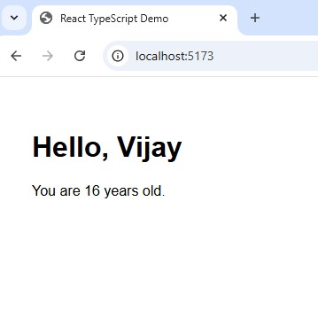

# React TypeScript Role for Large Scale FE App

A minimal React application built with TypeScript and Vite.
 

# Features

- **TypeScript support**: Leverages static typing for safer code.

- **Vite-powered**: Fast development server with HMR and optimized builds.

- **React plugin**: Official Vite plugin for React and JSX support.

# Project Structure

```
typescript-role-app/
├── index.html         # Entry HTML
├── vite.config.ts     # Vite configuration with React 
├── src/
│   ├── index.tsx      # App entry point
│   ├── App.tsx        # Root React component
│   └── types.ts       # TypeScript types/interfaces
├── tsconfig.json      # TypeScript compiler options
├── package.json       # NPM scripts and dependencies
└── README.md          # Project documentation

```

## Prerequisites

- Node.js v14+ (recommended)
- npm v6+ or yarn v1+

## Installation

### Clone the repository:

```bash 
git clone https://github.com/pottavijay/typescript-role-app.git
cd typescript-role-app
```

### Install dependencies:

```bash
npm install
# or
yarn install
```

## Development

Start the Vite dev server with:

```bash
npm run dev
# or
yarn dev
```

Open your browser at the URL shown in the console (usually http://localhost:5173).

## Build for Production

Generate optimized assets with:

```bash
npm run build
# or
yarn build
```

Preview the production build locally:
```bash
npm run preview
# or
yarn preview
```

## Configuration Notes

index.html must be at the project root. Vite will auto-resolve <script type="module" src="/src/index.tsx"></script>.

### vite.config.ts uses the @vitejs/plugin-react plugin:

```bash
import { defineConfig } from 'vite';
import react from '@vitejs/plugin-react';

export default defineConfig({
  plugins: [react()],
});
```
*TypeScript is enabled via tsconfig.json with strict settings and JSX support.*


## License

This project is licensed under the MIT License. See LICENSE for details.
